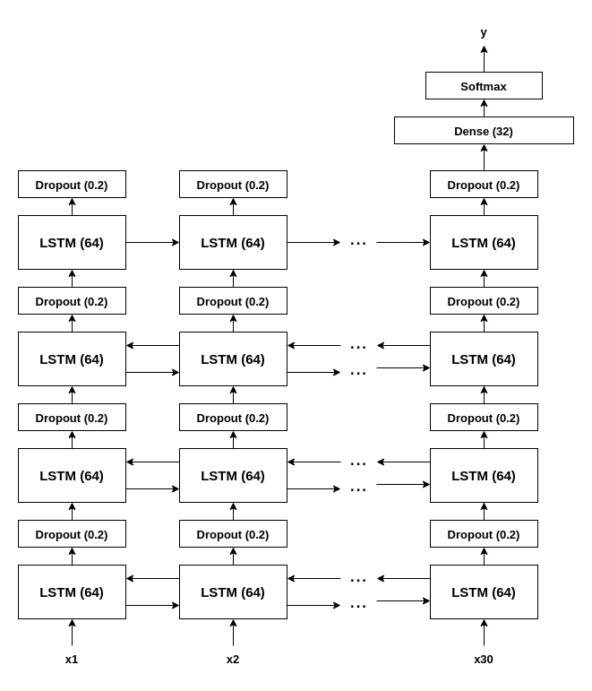

# NLP - Disaster Tweets Classification
The aim is to predict whether a tweet is about a natural disaster or not using a dataset provided by a [kaggle task](https://www.kaggle.com/c/nlp-getting-started).

## Dataset

The training data consists of over 7000 labeled tweets.
Columns:
+ `id` - a unique identifier for each tweet
+ `text` - the text of the tweet
+ `location` - the location the tweet was sent from (may be blank)
+ `keyword` - a particular keyword from the tweet (may be blank)
+ `target` - in train.csv only, this denotes whether a tweet is about a real disaster (1) or not (0)

## Libraries
`pip install -r requirements.txt`
+ numpy
+ pandas
+ tensorflow
+ scikit-learning

## How to run?

Just run the `main.py` file! You'll be asked to copy-paste a tweet you wannna predict.

## Neural Network
3-layer RNN with LSTM units, dropouts and two fully-connected layers in the end.

So far, the length of the sequence has been set to 30, longer tweets are cut and shorter are padded.

  

